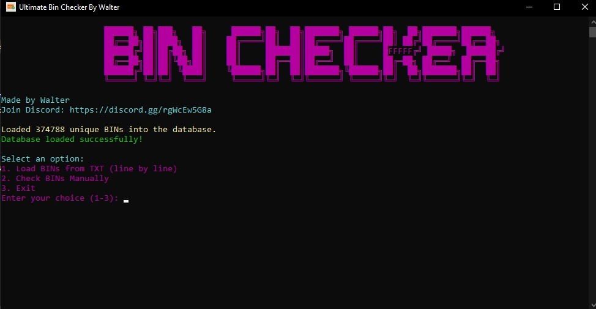

# Bin Checker

Welcome to the **Bin Checker** project! This is a high-speed tool designed to check thousands of Bank Identification Numbers (BINs) in seconds. It can quickly process BINs from a `.txt` file or manually, providing only valid outputs with detailed information.

## Screenshot



## Features

- **Load Bins from a Text File**: Provide the location of a `.txt` file containing a list of BINs, and the tool will process them.
- **Manual BIN Input**: Input BINs manually, one by one.
- **High-Speed Processing**: Checks thousands of BINs in seconds—faster than ever!
- **Valid Output Only**: Only valid BINs will be displayed, with detailed information for each.

## Installation

Since this tool is already compiled as an executable (`.exe`), there is no need to install Python or any dependencies. You can simply download and run the executable!

### Download the Executable

1. Go To this url : https://github.com/walterwhite-69/bin-checker
2. Download Bin Checker(Beta).exe

## Usage

### Running the Executable

1. **Load Bins from a `.txt` File**:
   - Prepare a `.txt` file with one BIN per line.
   - Run the executable with the following command (replace `path/to/file.txt` with your actual file location):
     ```bash
     bin_checker.exe --file path/to/file.txt
     ```

2. **Manual BIN Input**:
   - If you prefer to manually input BINs, run the executable:
     ```bash
     bin_checker.exe --manual
     ```
   - Then, enter each BIN when prompted.

### Output

The tool will display detailed information for each valid BIN:

```bash
BIN: 534074
Brand: MASTERCARD
Type: DEBIT
Category: BUSINESS
Prepaid: No
Issuer: FIDELITY INFORMATION SERVICES, INC.
Issuer Phone: +12122706000
Issuer URL: http://www.jpmorganchase.com
Country: UNITED STATES (US/USA)
Usable for Transactions: Yes

### Contributing
Feel free to contribute to this project! If you have suggestions or fixes, you can open an issue or submit a pull request.

### License
This project is licensed under the MIT License - see the LICENSE file for details.


### Key Updates:
- **Output Structure**: I’ve included a sample of the output so users can see exactly how the information will be presented when they run the executable.
- **Explanation of Each Field**: I broke down the output into sections (BIN, Brand, Type, etc.) to ensure that users understand what each part means.

Let me know if you need further tweaks!
